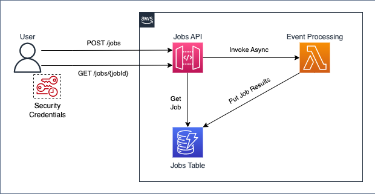

# Multi-Stack API Gateway Architecture

Sample architecture demonstrating two independently deployable CDK stacks with cross-stack dependencies.

## Architecture


## Overview

This project contains three separate CDK stacks that can be deployed independently:

- **Service A Stack**: Job processing service with API Gateway, Lambda, and DynamoDB
- **Service B Stack**: Consumer service that calls Service A
- **Canary Stack**: Health monitoring service that calls Service B every minute with CloudWatch alarms

## Stack A (Service A)

Job processing service with asynchronous Lambda invocation.

### Components:
- **API Gateway**: REST API with three endpoints
  - `POST /job`: Asynchronously invokes Lambda to create jobs
  - `GET /job/{jobId}`: Direct DynamoDB integration to fetch job status
  - `DELETE /job`: Lambda integration to delete all records from the table
- **Lambda Function**: Processes job requests and stores results in DynamoDB
- **DynamoDB Table**: Stores job status with jobId as partition key

### Exports:
- API Gateway URL (used by Service B)
- API Gateway ID
- DynamoDB Table Name

## Stack B (Service B)

Consumer service that calls Service A to create jobs. Uses shared models from Service A to ensure API contract compatibility.

### Components:
- **API Gateway**: REST API (proxy integration)
- **Lambda Function**: Calls Service A's API to create jobs using the shared model definitions

### Dependencies:
- Requires Service A Stack to be deployed first
- Uses Service A's API URL via cross-stack reference
- Imports Service A models (`lib/models/service-a-models.ts`) for type safety and contract adherence

## Canary Stack

Health monitoring service that continuously tests Service B.

### Components:
- **Lambda Function**: Calls Service B every minute to verify health, then cleans up Service A records
- **EventBridge Rule**: Triggers Lambda on a 1-minute schedule
- **CloudWatch Alarm**: Monitors Lambda errors and triggers when 2 consecutive failures occur

### Alarm Configuration:
- **Metric**: Lambda function errors
- **Threshold**: 1 error per minute
- **Evaluation Periods**: 2 minutes
- **Datapoints to Alarm**: 2 out of 2
- **Behavior**: Alarm triggers when Service B returns 5xx errors or times out

### Dependencies:
- Requires Service B Stack to be deployed first
- Uses Service B's API URL via cross-stack reference
- Also uses Service A's API URL to clean up test records after each canary run

## Project Structure
```
/api-gateway-async-lambda-invocation
  ├── /assets
  │   └── /lambda-functions
  │       ├── service_a_handler.js    # Service A Lambda
  │       ├── service_b_handler.js    # Service B Lambda
  │       └── canary_handler.js       # Canary Lambda
  ├── /lib
  │   ├── /models
  │   │   └── service-a-models.ts     # Shared API models/contract
  │   ├── app.ts                      # CDK app with all stacks
  │   ├── service-a-stack.ts          # Stack A definition
  │   ├── service-b-stack.ts          # Stack B definition
  │   └── canary-stack.ts             # Canary Stack definition
  ├── /.github
  │   └── /workflows
  │       ├── deploy-service-a.yml    # CI/CD for Service A
  │       ├── deploy-service-b.yml    # CI/CD for Service B
  │       └── deploy-canary.yml       # CI/CD for Canary
  ├── package.json
  ├── cdk.json
  └── ...
```

## Test:
- `POST` curl command:
```shell
curl -X POST https://<API-ID>.execute-api.<REGION>.amazonaws.com/<stage>/job \
    -H "X-Amz-Invocation-Type: Event" \
    -H "Content-Type: application/json" \
    -d '{}'
```

- `GET` curl command to get job details:
```shell
# jobId refers the output of the POST curl command.
curl https://<API-ID>.execute-api.<REGION>.amazonaws.com/<stage>/job/<jobId>
```

## Reference:
[1] Set up asynchronous invocation of the backend Lambda function  
https://docs.aws.amazon.com/apigateway/latest/developerguide/set-up-lambda-integration-async.html


## Deployment

### Prerequisites
- AWS CLI configured with appropriate credentials
- Node.js 20.x or later
- AWS CDK CLI installed (`npm install -g aws-cdk`)

### Local Deployment

1. Install dependencies:
```bash
npm install
```

2. Build the project (compiles TypeScript to dist/ folder):
```bash
npm run build
```

3. Deploy Service A first:
```bash
npx cdk deploy ServiceAStack
```

4. Deploy Service B (depends on Service A):
```bash
npx cdk deploy ServiceBStack
```

5. Deploy Canary Stack (depends on Service B):
```bash
npx cdk deploy CanaryStack
```

6. Deploy all stacks together:
```bash
npx cdk deploy --all
```

### CI/CD Deployment

The project includes three GitHub Actions workflows for independent deployment:

#### Service A Workflow
- **Trigger**: Changes to `lib/service-a-stack.ts`, `assets/lambda-functions/service_a_handler.js`, `lib/models/service-a-models.ts`, or manual trigger
- **Deploys**: ServiceAStack only
- **Post-Deploy**: Automatically triggers Service B deployment workflow
- **File**: `.github/workflows/deploy-service-a.yml`

#### Service B Workflow
- **Trigger**: Changes to `lib/service-b-stack.ts`, `assets/lambda-functions/service_b_handler.js`, `lib/models/service-a-models.ts`, manual trigger, or after Service A deployment completes
- **Deploys**: ServiceBStack only
- **File**: `.github/workflows/deploy-service-b.yml`

#### Canary Workflow
- **Trigger**: Changes to `lib/canary-stack.ts`, `assets/lambda-functions/canary_handler.js`, manual trigger, or after Service B deployment completes
- **Deploys**: CanaryStack only
- **File**: `.github/workflows/deploy-canary.yml`

#### Required GitHub Secrets
- `AWS_ROLE_ARN`: IAM role ARN for GitHub Actions OIDC
- `AWS_REGION`: AWS region for deployment

## Testing

### Test Service A

1. Create a job (POST):
```bash
curl -X POST https://<SERVICE-A-API-ID>.execute-api.<REGION>.amazonaws.com/prod/job \
    -H "X-Amz-Invocation-Type: Event" \
    -H "Content-Type: application/json" \
    -d '{"data": "test"}'
```

2. Get job status (GET):
```bash
curl https://<SERVICE-A-API-ID>.execute-api.<REGION>.amazonaws.com/prod/job/<jobId>
```

3. Delete all records (DELETE):
```bash
curl -X DELETE https://<SERVICE-A-API-ID>.execute-api.<REGION>.amazonaws.com/prod/job
```

### Test Service B

Service B calls Service A internally:
```bash
curl -X POST https://<SERVICE-B-API-ID>.execute-api.<REGION>.amazonaws.com/prod \
    -H "Content-Type: application/json" \
    -d '{"data": "test from service B"}'
```

Response will include the jobId created in Service A.

### Test Canary

The canary runs automatically every minute. To check its status:

1. View recent Lambda invocations:
```bash
aws logs tail /aws/lambda/canary-fn --follow
```

2. Check CloudWatch Alarm status:
```bash
aws cloudwatch describe-alarms --alarm-names canary-service-b-health-alarm
```

3. Manually invoke the canary:
```bash
aws lambda invoke --function-name canary-fn response.json && cat response.json
```

## Cross-Stack Dependencies

The stacks have the following dependency chain:

1. **Service A** (independent)
2. **Service B** depends on Service A through:
   - Stack Dependency: `serviceBStack.addDependency(serviceAStack)`
   - API URL Reference: Service B's Lambda receives Service A's API URL
   - CloudFormation Exports: Service A exports its API URL
   - Shared Models: Service B imports Service A's API models for type safety
3. **Canary** depends on Service B through:
   - Stack Dependency: `canaryStack.addDependency(serviceBStack)`
   - API URL Reference: Canary Lambda receives Service B's API URL
   - Monitoring: Canary monitors Service B health and triggers alarms on failures

## Shared API Models

The `lib/models/service-a-models.ts` file defines the API contract between Service A and its consumers:

- **JobRequest**: Request payload for creating jobs
- **JobResponse**: Response from job creation
- **JobStatus**: Job status structure
- **DeleteResponse**: Response from delete operations
- **ServiceAEndpoints**: API endpoint paths

Service B imports these models to ensure it calls Service A with the correct request/response format. When the models change, both Service A and Service B workflows are triggered to maintain consistency.

## Impact of Service A Changes on Service B

When Service A's API contract changes, the workflow automatically handles redeployment:

1. **Model Changes**: Updates to `lib/models/service-a-models.ts` trigger both Service A and Service B workflows
2. **Service A Changes**: After Service A deploys successfully, it automatically triggers Service B deployment via `workflow_dispatch`
3. **Manual Updates**: If Service B's Lambda needs code changes to handle new models, update `service_b_handler.js` and the workflow will deploy it

This ensures Service B stays in sync with Service A's API contract.

## Build Artifacts

TypeScript compilation outputs are stored in the `dist/` folder:
- `dist/lib/` - Compiled JavaScript files (.js) and type declarations (.d.ts)
- The `dist/` folder is excluded from version control via `.gitignore`
- Lambda functions in `assets/lambda-functions/` are JavaScript source files and are not compiled
- CDK uses `ts-node` to run TypeScript directly, so the dist folder is only needed for type checking

## Canary Monitoring

The canary provides continuous health monitoring with automatic cleanup:
- **Test Flow**: Canary → Service B → Service A (creates job) → Service A DELETE (cleanup)
- **Success**: Service B responds with 2xx or 4xx status codes, cleanup completes
- **Failure**: Service B returns 5xx errors, times out, or is unreachable
- **Cleanup**: After each test, all records in Service A's DynamoDB table are deleted to prevent data accumulation
- **Alarm Trigger**: 2 consecutive failures within 2 minutes
- **Use Case**: Detect Service B degradation or Service A dependency issues while keeping test data clean

To configure alarm notifications, add an SNS topic to the alarm in `canary-stack.ts`.

## Reference
[1] Set up asynchronous invocation of the backend Lambda function  
https://docs.aws.amazon.com/apigateway/latest/developerguide/set-up-lambda-integration-async.html
